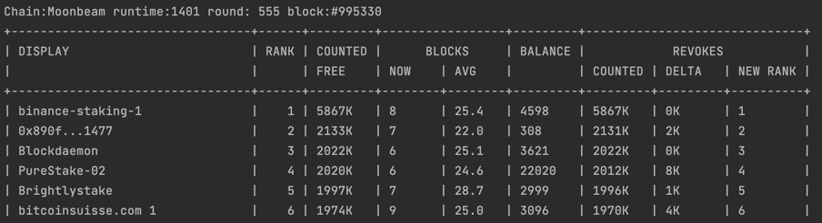

# MoonCli
A small set of useful console tools for the moonbeam chains

### Chain info
Show chain state at a given block or round, for example we can get chain status 20 blocks before round 512 started using this command.
```bash
mooncli info --round 512 --block -20
 ```
This will output:
```json
{
  "info": {
    "endpoint": "wss://wss.api.moonbeam.network",
    "chain": "Moonbeam",
    "spec": 1401,
    "block": {
      "current": 917380,
      "hash": "0xf57dfe4e1a3edb48305c9a3940b68c8bfa236ca7c00b472d8b3c4e1278b852a5",
      "ts": 1651178748592,
      "duration": 12.7524192
    },
    "round": {
      "number": 511,
      "length": 1800,
      "start": 915600,
      "revoke_delay": 28
    },
    "candidate_pool": {
      "selected": 64,
      "total": 77
    },
    "token": {
      "decimals": 18,
      "symbol": "GLMR"
    }
  }
}
```

### Collator ranking
You can dump collator ranking as JSON or to an ASCII table, so for example, to get current ranking with blocks average 
across last 8 rounds and revokes counted/ranking after 1 week you can use:
```bash
mooncli collators table --history 8 --revoke-rounds 28
```
This will result in:

Check the subcommand help for more info, as the info command you can use round and block options to show ranking at a 
specific block or round

### Serve
If you need to watch collator ranking you can use the serve method to start a server that will provide the ranking 
through a small API, endpoints provided will be:
  - **/info** current chain state and last update
  - **/collators** chain pool ranking
  - **/collators/address** chain pool ranking for a given collator
  - **/delegations/address** delegations for a given delegator or collator
  - **/healthz** will return 5XX if last update was more than 1.5 times the interval
